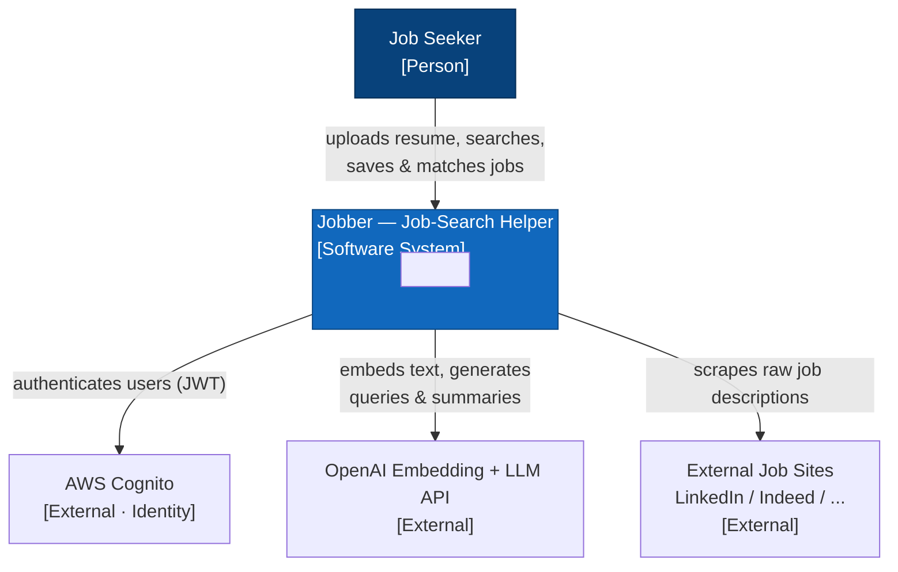
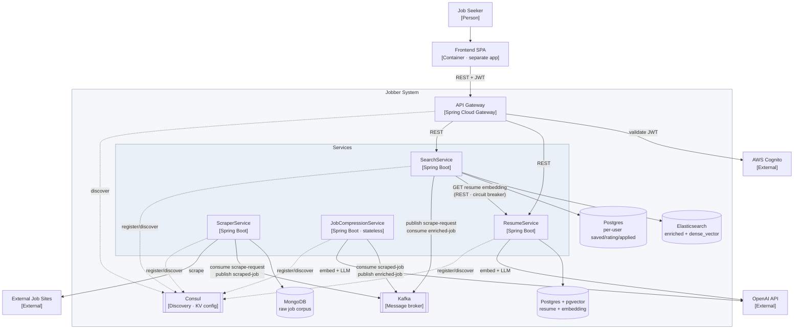

# Jobber — Architecture & Design

> Job-Search Helper Application. Small microservices system (4 services) built as a
> course project (CS590) and portfolio piece. This document is the source of truth for
> the design so any session/teammate can pick it up. Last updated: 2026-08-10.

## 1. Goals & constraints

- **Dual goal:** ship a tool the authors will actually job-hunt with **and** a portfolio
  piece that's explainable in interviews.
- **Microservices is a fixed constraint** (course requirement; already learned the
  material). Do not "simplify" to a monolith.
- **Multi-user.** The scraped job corpus is **global/shared** across all users; only
  saved-job lists, ratings, and applied-status are per-user.
- **Eventual deployment target: AWS.** Prefer choices that migrate local→AWS without
  swapping mechanisms.
- **Event-driven** where it buys resilience (the scrape→enrich→index pipeline).

## 2. Services (4) — responsibilities & storage

| Service | Responsibilities | Datastore |
|---|---|---|
| **ResumeService** | Accept resume upload; parse to structured fields; embed via shared model; **one LLM call on upload** to generate suggested search queries; expose the resume embedding to Search at match time. | **Postgres + pgvector** (per Cognito `sub`: resume text/fields, embedding, generated queries) |
| **ScraperService** | Consume `scrape-request` events; run per-site scrapers to fetch raw job descriptions; enforce **freshness rule**; dedupe; emit `scraped-job` events. | **MongoDB** (raw global corpus + per-query freshness metadata) |
| **JobCompressionService** | Consume `scraped-job`; parse raw → structured fields (core requirements, experience level, must-haves vs nice-to-haves, responsibilities); summarize; embed via shared model; emit `enriched-job`. **Stateless stream processor.** | **None** (Kafka log is source of truth; idempotent by job id / content hash) |
| **SearchService** | Query the ES index (returns stale-now); trigger refresh events; index enriched jobs; compute **on-demand cosine match**; own per-user state. | **Elasticsearch** (enriched corpus + `dense_vector`) **+ small Postgres** (per-user: `cognito_id, job_id, rating, applied`) |

### Data ownership rules (do not violate)
- **Scraper owns raw**, **Search owns enriched+searchable**. Never store enriched jobs in
  Scraper's Mongo, and never store raw scrapes in Search.
- The **enriched/compressed job IS the searchable ES document** — that's the whole point
  of compressing. Compression produces it; Search persists/indexes it.
- Resume parsing lives **only** in ResumeService (was duplicated in the original plan).
- Match/ranking lives **only** in SearchService (was a separate "matching tool" module).

## 3. System diagrams (C4)

### 3.1 Context diagram (who/what the system talks to)



### 3.2 Container diagram (services, stores, infra)



## 4. End-to-end pipeline

```
1. Resume upload
   → ResumeService: parse → embed (shared API) → LLM makes suggested queries
   → stores in Postgres + pgvector

2. User searches (a suggested or custom query)
   → SearchService queries its Elasticsearch index
   → returns instantly with whatever exists (STALE-NOW; user never blocks on scraping)

3. Freshness check: if <10 results for the query OR results >7 days old
   → SearchService emits `scrape-request` event → Kafka

4. ScraperService consumes → per-site fetch → stores RAW in Mongo → emits `scraped-job`

5. JobCompressionService consumes `scraped-job`
   → parse/structure/summarize → embed (shared API)
   → emits `enriched-job`   (stateless; stores nothing)

6. SearchService consumes `enriched-job` → indexes into Elasticsearch
   → fresh results appear on the user's NEXT query (poll, not push)

7. User clicks "match" on a job (on-demand, cheap)
   → SearchService pulls the resume embedding from ResumeService (REST)
   → cosine similarity → a % NUMBER ONLY (no LLM verdict)
   → stores rating + saved job-id + applied-status keyed by Cognito `sub` (Postgres)
```

### 4.1 Pipeline sequence diagram

```mermaid
sequenceDiagram
    actor U as Job Seeker
    participant R as ResumeService
    participant S as SearchService
    participant K as Kafka
    participant SC as ScraperService
    participant C as JobCompressionService

    U->>R: Upload resume
    R->>R: Parse + embed + LLM suggested queries
    Note over R: stored in Postgres + pgvector

    U->>S: Search (suggested / custom query)
    S-->>U: Current results (STALE-NOW, never blocks)
    alt <10 results OR results >7 days old
        S->>K: publish scrape-request
    end

    K->>SC: scrape-request
    SC->>SC: fetch per-site, store raw (Mongo), dedupe
    SC->>K: publish scraped-job
    K->>C: scraped-job
    C->>C: parse / summarize / embed (stateless)
    C->>K: publish enriched-job
    K->>S: enriched-job
    S->>S: index enriched job into Elasticsearch
    Note over U,S: fresh results appear on the user's next query (poll)

    U->>S: Click "match" on a job
    S->>R: GET resume embedding (REST · circuit breaker)
    R-->>S: embedding vector
    S->>S: cosine similarity -> % ; store rating/saved/applied (Postgres)
    S-->>U: match %
```

### Freshness rule (Scraper)
A query re-scrapes if **either**: fewer than **10** stored results for that query, **or**
the stored results are **older than 7 days**. Users may also add custom queries that the
scrape/search path runs the same way.

## 5. Cross-cutting decisions

- **Messaging:** **Kafka**. Topics follow the pipeline: `scrape-request` → `scraped-job`
  → `enriched-job`. Chosen over RabbitMQ for the durable, replayable log and the stronger
  interview story.
- **Embeddings:** **shared external embedding API with a pinned model + dimension**
  (via Spring AI, OpenAI provider). ResumeService and JobCompressionService **must** use
  the **same model/vector space** or cosine match scores are meaningless. Treat a model
  change as an explicit re-embedding migration.
- **Matching is on-demand and cheap:** user-triggered cosine similarity → a single %
  number. There is **no** LLM "good/bad fit" writeup (explicitly cut from the original
  plan).
- **Refresh is background:** search returns immediately; scraping/enrichment happen async;
  results surface on the next query.
- **Service discovery / edge:** **Consul** (discovery + health + KV config) + **Spring
  Cloud LoadBalancer** (client-side LB) + **Spring Cloud Gateway** as the frontend→backend
  entry point. Chosen for portability (same mechanism local and on AWS — no swap on
  migration) over ECS Cloud Map / EKS DNS. *Not yet wired into the POMs.*
- **Resilience:** **Resilience4j circuit breakers** on synchronous REST calls (via
  `spring-cloud-starter-circuitbreaker-resilience4j`). Primary protected call today:
  Search → Resume (embedding fetch); also outbound calls to the embedding API and to
  external job sites. **Added to all four POMs.**
- **Auth:** **AWS Cognito**, deferred. Cognito `sub` is the per-user key everywhere. The
  Gateway will validate the Cognito JWT and forward `sub`; services trust it. No dedicated
  user service.

## 6. Deltas from the original 4-module sketch
1. "Resume reading" was duplicated across two modules → collapsed into **ResumeService**.
2. The "matching tool" module → folded into **SearchService** (it already owns embeddings
   + ranking). Match is one cosine call; too thin to be its own service.
3. The **LLM good/bad-fit verdict was dropped** in favor of a pure embedding %.
4. Scraper ≠ Search: split into **write-side (Scraper) vs read-side (Search)** with a
   **Compression** enrichment step between them, synced over Kafka.
5. A separate **User service was considered and rejected** — per-user state lives in
   SearchService keyed by Cognito `sub`.

## 7. Tech stack / versions
- **Spring Boot 4.1.0**, **Java 25**, Maven, `groupId cs590`.
- Spring Cloud release train **2025.1.2 ("Oakwood")** (supports Boot 4.1).
- Spring AI **2.0.0** (pgvector vector store + OpenAI model starter).
- Resilience4j **2.3.0** (via spring-cloud-starter-circuitbreaker-resilience4j **5.0.2**).
- Note: Boot 4 renamed `spring-boot-starter-web` → `spring-boot-starter-webmvc`.

## 8. Dependency status (per service)

Legend: ✅ present · ➕ added in this pass · ⬜ still to add later

- **ResumeService:** webmvc ✅, spring-ai pgvector vector-store ✅, postgres ✅,
  resilience4j ➕, spring-ai OpenAI model starter ➕, spring-data-jpa ➕, actuator ➕.
- **ScraperService:** mongodb ✅, kafka ✅, webmvc ✅, resilience4j ➕, actuator ➕.
  ⬜ `jsoup` (HTML parsing) — add when building per-site scrapers (not a Spring starter).
- **JobCompressionService:** kafka ✅, webmvc ✅, resilience4j ➕, spring-ai OpenAI model
  starter ➕, actuator ➕. No DB (stateless) — correct.
- **SearchService:** elasticsearch ✅, kafka ✅, webmvc ✅, postgres ✅, resilience4j ➕,
  spring-data-jpa ➕, actuator ➕.

⬜ **Everywhere, still to wire:** Consul discovery (`spring-cloud-starter-consul-discovery`)
+ client-side LB; Spring Cloud Gateway module; Cognito JWT validation at the gateway.

## 9. Open items / not yet decided
- **Frontend** — assumed a separate app; not in scope of these 4 services.
- **User preferences** — deferred (would live with per-user state in SearchService).
- **Scraping ToS / robots.txt legality** — not architectural, but note it in the README so
  reviewers see it was considered.
- **Push vs poll** for surfacing fresh results — currently **poll** (next query). Push is a
  possible later enhancement.
- **Embedding model/dimension** — pin the exact model name + dimension in shared config
  before writing embedding code.
