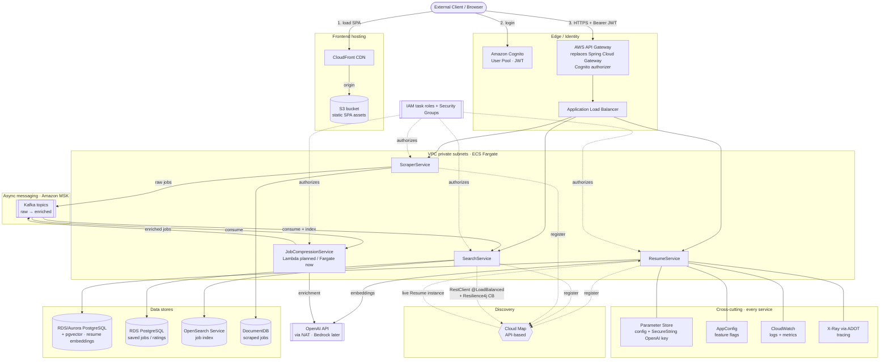
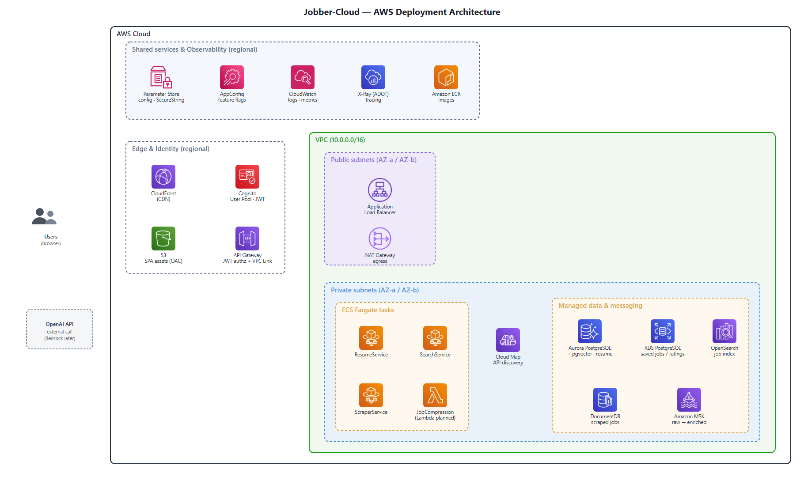

# Deployment Architecture — AWS (Route 1)

Deployment of the Jobber stack to AWS. Locally (Docker Compose) it runs **5 Spring Boot
services** — `Gateway`, `ResumeService`, `SearchService`, `ScraperService`,
`JobCompressionService` — plus a React/Vite UI. In the AWS target the Spring Cloud `Gateway`
service is **replaced by AWS API Gateway**, leaving 4 business services on Fargate. This
document records, per microservice aspect, the options AWS offers (lift-and-shift vs.
AWS-managed), the option this project chose, a container diagram, and the concrete
library/dependency changes from local → AWS.

> Grounding: choices align with the route-1 cloud lessons. Key mechanism decisions —
> Cloud Map **API-based** discovery (not DNS), X-Ray via **ADOT/OpenTelemetry** (not the
> legacy SDK), and Parameter Store **SecureString** for the API key (rotation not needed) —
> are called out in the "Chosen" column and the notes.

## Options & decisions per aspect

| Aspect | Course tool (local) | Option B — lift & shift (self-managed on AWS) | Option A — AWS-managed options | **Chosen** | Why |
|---|---|---|---|---|---|
| **Frontend hosting** | local dev server | Nginx serving SPA on EC2/ECS | **S3 + CloudFront**, Amplify Hosting | **S3 + CloudFront** | Static SPA assets in S3, served by CloudFront CDN. No AWS SDK needed to host — app calls API Gateway over HTTPS with the Cognito JWT |
| **Compute / runtime** | local JVM / Docker | EC2 running containers you manage | ECS+Fargate, EKS, App Runner, Lambda | **ECS + Fargate** (all 4 services); **Lambda** for compressor | No node management; Fargate = least ops. Compressor is stateless/bursty → Lambda re-architecture |
| **Discovery (registry)** | Consul / Eureka | Consul/Eureka on EC2/ECS | Cloud Map (DNS **or** API), ECS Service Connect | **Cloud Map — API-based** (`DiscoverInstances`) | Keeps registry managed *and* keeps client-side LB honest; JVM caches DNS, so DNS-based silently loads-balances against a stale list |
| **Load balancing — north-south** | — | self-managed proxy | **ALB**, NLB | **ALB** | L7 front door for external traffic; path/host routing |
| **Load balancing — east-west** | Spring Cloud LoadBalancer (client-side) | same, unchanged | Service Connect / App Mesh (server-side, in sidecar) | **Client-side** (Spring Cloud LoadBalancer, `lb://`) | Course-faithful; keeps the LB decision in app code. (App Mesh is retired 2026-09-30 — not an option) |
| **API Gateway** | Spring Cloud Gateway (own `Gateway` service) | Spring Cloud Gateway on ECS | **API Gateway**, ALB-as-gateway | **AWS API Gateway** (replaces the Spring `Gateway` module entirely) | Managed edge: throttling + Cognito authorizer + routing. The Spring Cloud Gateway service is deleted — must forward the JWT `sub` [note 3] and reach the internal ALB via a VPC Link [note 4] |
| **Sync comms (REST)** | `RestClient` `@LoadBalanced` (not Feign) | unchanged | unchanged | **`RestClient` `@LoadBalanced`** (`lb://ResumeService`) | Only sync inter-service call is Search→Resume (embedding fetch). `lb://` now resolves via Cloud Map instead of Consul |
| **Async comms (messaging)** | Kafka | Kafka on EC2/ECS (self-run brokers) | **MSK**, MSK Serverless, SNS+SQS, EventBridge | **MSK** (consider **MSK Serverless** for demo) | Needs **replay / event sourcing** → real Kafka log+offset. SNS+SQS can't replay; MSK Serverless = same semantics, zero broker sizing |
| **Resilience (circuit breaker)** | Resilience4j (`@CircuitBreaker`) | Resilience4j, unchanged | Service Connect sidecar (retries/outlier detection) | **Resilience4j** (in-code, on the Search→Resume `RestClient` call) | Consistent with client-side E-W path; keeps control in app |
| **Config (non-secret)** | Spring Cloud Config | Config Server on ECS | **Parameter Store**, AppConfig | **Parameter Store** (+ **AppConfig** for feature flags/rollout) | Parameter Store = simple/free default; AppConfig adds validated, auto-rollback config deploys |
| **Secrets (API keys / passwords)** | Config + Vault | Vault on EC2 | Secrets Manager, **Parameter Store SecureString** | **Parameter Store — SecureString** | KMS-encrypted, IAM-gated, free tier. Covers the OpenAI key **and** the RDS/DocumentDB passwords [note 7]. Rotation not needed → Secrets Manager's cost not justified |
| **Security — end-user auth** | Keycloak / OAuth2 | Keycloak on ECS | **Cognito** | **Cognito** (User Pool + App Client) | Managed OAuth2/JWT. Note: Cognito Groups are a weaker analog of Keycloak Roles (no built-in fine-grained RBAC) |
| **Security — service/resource auth** | (none) | (none) | **IAM roles**, security groups | **IAM roles + security groups** | Task role grants each service its AWS permissions; SGs gate network reachability |
| **Tracing** | Zipkin / Sleuth | Zipkin on ECS | **X-Ray** (via **ADOT**) | **X-Ray backend, ADOT collector** | ADOT auto-instruments HTTP; the async Kafka hops need manual context propagation to trace end-to-end [note 8] |
| **Logging** | ELK | ELK on ECS/EC2 | **CloudWatch Logs** | **CloudWatch Logs** | Native, no stack to run; metrics + log insights |
| **AI / embeddings** | **Spring AI + OpenAI** (`spring-ai-starter-model-openai`) | self-hosted model | Bedrock, or keep Spring AI over OpenAI | **Spring AI + OpenAI now**; Bedrock later | Keep it simple for now — code already uses Spring AI/OpenAI. OpenAI is an external call, so services need NAT egress. Swap to `spring-ai-...-bedrock` later |

### Data stores per service (AWS names)

Reflects the actual code, not an idealized 1-DB-per-service split — **SearchService uses two
stores**, and the compressor is stateless. RDS won't run the local `postgres-init.sql`, so the
`resume`/`search` databases + schema must be created another way [note 1].

| Service | Store(s) | AWS service |
|---|---|---|
| ResumeService | PostgreSQL + pgvector | RDS / Aurora PostgreSQL |
| SearchService | Elasticsearch (job index) **+** PostgreSQL (saved jobs / ratings) | Amazon OpenSearch Service **+** RDS PostgreSQL |
| JobCompressionService | — (stateless; Kafka consumer→producer) | — |
| ScraperService | MongoDB | Amazon DocumentDB (or MongoDB Atlas) |

## Container diagram

### Reading the diagram

- **North-south** (external): browser **loads the SPA from CloudFront** (S3 origin), logs in
  via **Cognito** (JWT), then calls **API Gateway → ALB → services** with that JWT. AWS API
  Gateway *replaces* the current Spring Cloud Gateway service (deleted, not deployed).
- **East-west** (internal): there is exactly **one** sync inter-service call —
  **Search → Resume** (fetch resume embedding), made with a `@LoadBalanced` **`RestClient`**
  (`lb://ResumeService`) resolved through **Cloud Map API-based discovery** and wrapped in a
  **Resilience4j** circuit breaker. Not Feign.
- **Async pipeline**: **Scraper → MSK (raw) → JobCompression (enrich via OpenAI) → MSK
  (enriched) → Search (index)**. ResumeService is **not** a Kafka participant.
- **AI**: ResumeService (embeddings) and JobCompressionService (enrichment) call **OpenAI**
  over NAT today; Bedrock is a later swap.
- Cross-cutting edges (config/log/trace) are drawn from ResumeService only for readability —
  every service attaches to the same set. **IAM roles + security groups** authorize each
  service to reach its AWS resources.

## AWS deployment diagram (services & where they run)

Where the container diagram above is *logical* (who calls whom), this diagram is *topological*
— modeled after an AWS reference architecture: it shows the **Region boundary**, the **VPC**
with **public vs. private subnets across two Availability Zones**, and which **managed AWS
services sit inside the VPC vs. as regional endpoints outside it**. The boxes are the actual AWS
service icons, grouped by *where* they run (call/dependency arrows are deliberately omitted — the
request flow is spelled out below, and the logical "who-calls-whom" wiring is in the container
diagram above).

> Rendered from [`aws_architecture_svg.py`](aws_architecture_svg.py) — a hand-placed,
> fixed-coordinate SVG (official AWS icons embedded) rasterised to PNG via headless Chrome.
> Regenerate after editing: `python aws_architecture_svg.py`.

**Request flow (left → right):** the browser loads the SPA from **CloudFront** (S3 origin) → logs
in via **Cognito** (JWT) → calls **API Gateway** with the Bearer JWT → **VPC Link** to the
internal **ALB** → routed to a **Fargate** task. The one east-west sync call, Search → Resume,
resolves via **Cloud Map** (`@LoadBalanced` RestClient + Resilience4j). Async pipeline: Scraper →
**MSK** → JobCompression → **MSK** → Search. Private tasks reach **OpenAI** out through the **NAT
Gateway**. Cross-cutting (Parameter Store, AppConfig, CloudWatch, X-Ray, ECR) attaches to every
task.

### Where each AWS service runs

| Layer | AWS service | Runs where | Reached by |
|---|---|---|---|
| Edge | CloudFront + S3 | Regional (global edge / regional bucket) | Browser over HTTPS |
| Identity | Cognito | Regional endpoint | Browser (login), API Gateway (validate JWT) |
| API edge | API Gateway | Regional endpoint | Browser → VPC Link → ALB |
| N-S routing | ALB | **Public subnets**, multi-AZ | API Gateway VPC Link |
| Compute | ECS Fargate (4 services) | **Private subnets**, multi-AZ | ALB, Cloud Map |
| Compute (planned) | Lambda (compressor) | AWS-managed, VPC-attached | MSK event source |
| Discovery | Cloud Map | In-VPC namespace | Fargate tasks (`DiscoverInstances`) |
| Data | RDS/Aurora PostgreSQL ×2, OpenSearch, DocumentDB | **Private subnets**, multi-AZ | Owning service via security groups |
| Messaging | Amazon MSK | **Private subnets**, multi-AZ | Scraper / Compressor / Search (IAM auth) |
| Egress | NAT Gateway | **Public subnets** | Private tasks reaching OpenAI |
| Config/secrets | Parameter Store, AppConfig | Regional API (VPC endpoint) | All tasks (IAM task role) |
| Observability | CloudWatch, X-Ray (ADOT) | Regional API | All tasks |
| Images | ECR | Regional API (VPC endpoint) | ECS execution role at task start |

## Local (Docker) → AWS: library & dependency changes

What actually changes in the code/deploy when moving from the Docker Compose stack to AWS.
Verified against the current `pom.xml` files and `docker-compose.yml`. Three buckets: **swap**
(replace the dependency), **keep** (same library, different endpoint/backing), and **add**
(new concern with no local equivalent).

### Backend (Spring Boot services)

| Concern | Local dependency / mechanism | AWS action | Notes |
|---|---|---|---|
| Discovery | `spring-cloud-starter-consul-discovery` + Consul container | **Swap** → Spring Cloud AWS Cloud Map discovery (`io.awspring.cloud:spring-cloud-aws-starter`, CloudMap) | Configure **API-based** discovery. Consul container is deleted |
| Client-side LB | `spring-cloud-starter-loadbalancer` | **Keep** | Still resolves `lb://ServiceName`, now backed by Cloud Map instead of Consul |
| Sync inter-service | `RestClient` `@LoadBalanced` (in code) | **Keep** | No Feign in the codebase; nothing to add. Only Search→Resume uses it |
| Circuit breaker | `spring-cloud-starter-circuitbreaker-resilience4j` | **Keep** | In-code, unchanged |
| API Gateway | `spring-cloud-starter-gateway-server-webmvc` (whole `Gateway` module) | **Remove** | Deleted entirely; AWS API Gateway takes its place, incl. the JWT→`X-User-Sub` header injection the Gateway did |
| Messaging | `spring-boot-starter-kafka` (Apache Kafka client) | **Keep** + **add auth lib** | Point `KAFKA_BOOTSTRAP` at **MSK**. IAM auth needs the `aws-msk-iam-auth` jar + SASL/`AWS_MSK_IAM` JAAS config, and topics must be **pre-created** — see [note 2] |
| AI / embeddings | `spring-ai-starter-model-openai` | **Keep now** | Needs NAT egress to reach OpenAI. Later: swap to `spring-ai-...-bedrock` |
| Vector store | `spring-ai-starter-vector-store-pgvector` | **Keep** | pgvector runs on RDS/Aurora PostgreSQL |
| Relational DB | `postgresql` driver + pgvector image | **Keep** (driver) | Endpoint → RDS/Aurora; driver unchanged |
| Search DB | `spring-boot-starter-data-elasticsearch` (ES 9.x) | **⚠ Swap likely** | Amazon OpenSearch forked from ES 7.10 — the **ES 9.x client may not talk to OpenSearch**. Options: OpenSearch Java client, run ES on EC2 (lift-and-shift), or verify compat. Biggest migration risk |
| Document DB | `spring-boot-starter-data-mongodb` | **Keep** (driver) | Endpoint → DocumentDB (Mongo-compatible; check API-gap list) or MongoDB Atlas |
| Config (non-secret) | env vars / `application.properties` (no config server) | **Add** | Parameter Store / AppConfig via `spring-cloud-aws-starter-parameter-store` — new concern, not a swap |
| Secrets | `OPENAI_API_KEY` env var from `.env` | **Add/Swap** | Store as Parameter Store **SecureString**; inject via Spring Cloud AWS or ECS task secrets |
| Service auth | none | **Add** | IAM task roles + security groups (to read Parameter Store, MSK, S3, etc.) |
| Tracing | none (actuator only) | **Add** | ADOT sidecar/agent → X-Ray. Auto-instruments, no code |
| Logging | container stdout | **Add** | CloudWatch Logs via the `awslogs` / FireLens log driver |
| Compute | Docker Compose | **Swap** | ECS Fargate task/service per app; JobCompression optionally re-architected to Lambda (MSK event-source mapping + SnapStart) |

### Frontend (Jobber-UI — React 18 + Vite)

Current UI has **no AWS/auth libraries** (`react`, `react-dom`, `react-router-dom` only) and
**auth is stubbed**: `src/api/client.ts` sends a hand-set `X-User-Sub` header with the comment
*"Header the gateway would normally set from the validated Cognito JWT; stubbed here."*

| Concern | Local | AWS action | Notes |
|---|---|---|---|
| Hosting | Vite dev server / Nginx container (`nginx.conf`) | **Swap** → S3 + CloudFront | Build to static assets; **no library change** to host. But the SPA now needs its Cognito/API-URL config injected [note 6] |
| API base path | same-origin `/gw` + `/scraper`, reverse-proxied by Vite/Nginx | **Swap** the proxy | CloudFront behavior or API Gateway route to backend; direct calls need **CORS** [note 6]. `/scraper` (`/api/scrape`) is **not** gateway-routed today — it needs its own API Gateway route |
| Auth | **stubbed** `X-User-Sub` header (no login) | **Add** → `aws-amplify` (Auth) or an OIDC/Cognito lib | The one genuinely new frontend dependency: perform the Cognito login and send `Authorization: Bearer <JWT>`. API Gateway's Cognito authorizer then validates it and the service reads the `sub` claim — replacing the stub |

**Summary:** most backend libraries are **kept** (LB, RestClient, Resilience4j, Kafka client,
Spring AI, JPA/pgvector, Mongo driver) — only their endpoints/backing change. Genuine code
swaps are **Consul → Cloud Map**, **delete the Gateway module**, and **likely the Elasticsearch
client → OpenSearch**. New concerns to add: **Parameter Store/AppConfig, IAM roles, ADOT
tracing, CloudWatch logging**. On the frontend, the only new library is a **Cognito/Amplify auth
client** to replace the stubbed `X-User-Sub` header.

## AWS-only: things you can only make/configure on AWS

The library table above is *code*. This section is *platform* — infrastructure that Docker
Compose gave you for free (the default bridge network, `depends_on`, one-line service images)
or that had **no local equivalent at all**. None of this exists in `docker-compose.yml`; every
item is provisioned in AWS (console, CLI, or IaC) before the app can run.

### Foundation — networking (Compose gave this implicitly; AWS makes it explicit)

| AWS construct | Why it has no Compose equivalent | Needed for |
|---|---|---|
| **VPC + public/private subnets** (multi-AZ) | Compose's default bridge network auto-connects every container by name | Network isolation; where Fargate tasks + data stores live |
| **Route tables + Internet Gateway** | Routing was automatic on the bridge net | Public ingress path |
| **NAT Gateway** | Containers reached the internet freely | **OpenAI egress** from private-subnet tasks (real cost item) |
| **Security groups** | No per-service firewalling locally | Which service can reach RDS/OpenSearch/MSK on which port |
| **VPC endpoints** (S3, Parameter Store, ECR, …) | N/A locally | Reach AWS APIs privately, avoiding NAT charges |

### Identity & crypto — no local equivalent whatsoever

| AWS construct | Needed for |
|---|---|
| **IAM execution role** (per task) | Lets ECS pull the image from ECR + write logs |
| **IAM task role** (per service) | The service's own permissions: read Parameter Store, publish/consume MSK, read S3 |
| **IAM policies + trust relationships** | The actual permission statements attached to those roles |
| **KMS key(s)** | Encrypts Parameter Store `SecureString`, RDS/OpenSearch/DocumentDB at rest |
| **Cognito User Pool + App Client (+ hosted-UI domain)** | End-user auth — **replaces the stubbed `X-User-Sub`**; no local counterpart existed |

### Provisioning the managed data/messaging services (vs. a one-line Compose image)

| AWS construct | Replaces (Compose) |
|---|---|
| **RDS / Aurora PostgreSQL** instance + DB subnet group + parameter group | `pgvector/pgvector` image |
| **Amazon OpenSearch** domain | `elasticsearch:9.0.0` image |
| **Amazon DocumentDB** cluster | `mongo:7` image |
| **Amazon MSK** cluster + IAM/SASL auth + broker config | `apache/kafka` image |

### Compute & routing platform — net-new AWS objects

| AWS construct | Role |
|---|---|
| **ECR repositories** | Store the built service images (Compose built locally) |
| **ECS cluster + task definitions + services** (Fargate) | Run the containers |
| **Cloud Map namespace** | The registry backing `lb://` discovery (replaces Consul) |
| **ALB + target groups + listeners** | North-south L7 routing to tasks |
| **AWS API Gateway** (routes, **Cognito authorizer**, VPC link to ALB) | Replaces the Spring Cloud Gateway service — incl. a dedicated route for `/api/scrape` |
| **S3 bucket + Origin Access Control** & **CloudFront distribution + behaviors** | Host + serve the SPA |
| **ACM certificate + Route 53 records** | HTTPS + a real domain (local was plain `http://localhost`) |

### Config, secrets & observability wiring

| AWS construct | Replaces / adds |
|---|---|
| **Parameter Store** parameters (`SecureString` for the OpenAI key) | The `.env` / env-var config |
| **AppConfig** application/environment/profiles | Nothing local — new: validated config deploys, feature flags |
| **CloudWatch** log groups + metrics + alarms/dashboards | Container stdout |
| **ADOT collector + X-Ray** sampling config | Nothing local — new: distributed tracing |

### Delivery

| AWS construct | Replaces |
|---|---|
| **IaC stack** (CloudFormation / CDK / Terraform) | `docker-compose.yml` as the source of truth |
| **CI/CD pipeline** (build → push to ECR → deploy ECS) | `docker compose up --build` |

**The mental shift:** locally, *networking, discovery wiring, and "internet access" were free
and invisible*. On AWS every one of those becomes an object you create and a permission you
grant — the **VPC, IAM roles, and security groups** are the three you'll spend the most new
effort on, because they have zero Compose counterpart.

---

## Deploy-time notes & gotchas

Referenced inline above. These are the seams where "it ran in Compose" ≠ "it runs on AWS".

1. **DB bootstrapping** — RDS does not run `infra/postgres-init.sql`. Create the `resume` and
   `search` databases + schema yourself: add **Flyway/Liquibase** to the services (preferred), or
   run the SQL once against RDS. Otherwise every DB-backed service 500s on first boot.
2. **MSK auth + topics** — IAM-authenticated MSK needs the **`aws-msk-iam-auth`** jar plus
   SASL/`AWS_MSK_IAM` JAAS config in each Kafka service (not "no code change"). Also
   **pre-create topics** — MSK usually has `auto.create.topics.enable=false`, unlike the local broker.
3. **Cognito `sub` forwarding** — API Gateway's JWT authorizer must map
   `$context.authorizer.claims.sub` into a request header (or services read the raw JWT). This
   replaces the Spring Gateway's `X-User-Sub` injection the whole app keys off of.
4. **VPC Link** — API Gateway → an **internal** ALB requires a private-integration VPC Link, else
   routing just times out.
5. **Health checks** — point ALB target groups + ECS container health at **`/actuator/health`**,
   not `/`. A wrong path fails health checks and ECS kills tasks in a restart loop.
6. **Frontend runtime config + CORS** — the S3 SPA needs its **Cognito pool/client IDs and API
   Gateway URL** injected (Vite build-time env, or a runtime `config.json`) — no `.env`/proxy
   anymore. If it calls API Gateway directly (vs. a same-origin CloudFront behavior), enable **CORS**.
7. **Credentials** — the RDS/DocumentDB passwords (`jobber/jobber` locally) also belong in
   Parameter Store SecureString, not just the OpenAI key.
8. **Async trace propagation** — ADOT links HTTP spans automatically, but the
   **Scraper → Compressor → Search** Kafka hops only appear as one trace if you propagate trace
   context through Kafka headers. Honest caveat if observability is graded.
9. **Cost + teardown** — NAT, MSK, OpenSearch, RDS, and DocumentDB bill **per hour regardless of
   use**. Run single-AZ / single-NAT for the demo and keep a `destroy` step — a stack left up over
   a weekend is real money.
10. **Present Option B too** — the brief wants a justified A-vs-B choice. This doc details Option A
    (AWS-native); be ready to explain lift-and-shift (Consul/Keycloak/Kafka/Zipkin/ELK on EC2/ECS)
    and *why* you picked native.
